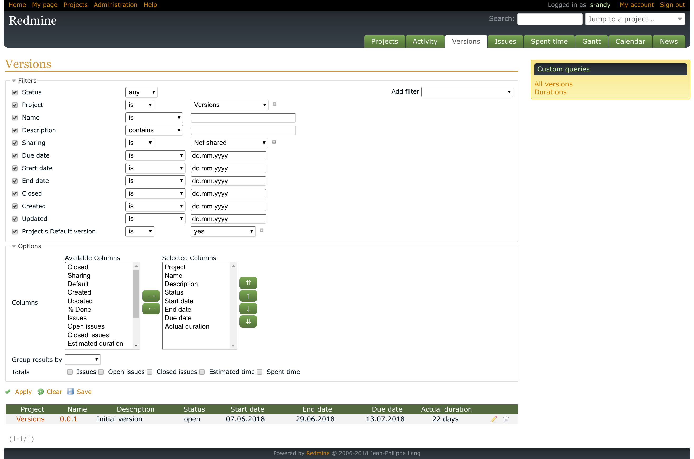

# Westaco Versions Plugin for Redmine

This plugin adds the new Versions page to Redmine's application (global) and
project menus. This page lists versions of all projects or of the project
(and its subprojects) correspondingly. It supports a query form (with filters,
columns etc) similar to the query forms, that can be found on Issues and
Spent time pages.

The plugin also adds the following additional fields to the Version model
(these fields can be used as query filters and columns):

- Start date (entered manually) - the date, when the work on the version is
  actually started.

- End date (entered manually) - the date, when the main work on the version is
  actually finished (unlike the existing due date, that represents the date,
  when the work is planned to be finished).

- Closed date (automatic) - the date, when the version was closed.

Additionally, the plugin adds the following dynamically calculated fields
(available as columns in the query form):

- Estimated duration - the number of days between the start date (or creation
  date, if the start date is not available) and the due date.

- Actual duration - the number of days between the start date and the end date,
  i.e., the number of days the version is actually being worked on.

- Remaining duration - the number of days until the end date or the due date
  (if the former is not available).

- Extra duration - the number of days between the end date and the due date.
  So, the column shows, whether the version was finished early or late.

Development of this plugin was sponsored by [Westaco](https://www.westaco.com/).

## Installation

- Move `westaco_versions` directory to the `plugins` directory of Redmine
- Run `rake redmine:plugins:migrate RAILS_ENV=production`
- Restart Redmine

## Notes

- In addition to the project's own versions, the project's Roadmap and the
  version list under the project's Settings tab also include versions, that
  are shared with the project. The version list provided by Westaco Versions
  does not do so - it includes only versions of the particular project and its
  subprojects.

- Counts for columns "Issues", "Open issues" and "Closed issues" and their
  totals may include issues, that are not visible to the user (e.g., private
  issues are not visible to users, "Issue visibility" for which is not set to
  "All issues").

- The start date, that comes with the plugin, replaces an internal version's
  property with the same name, that is used for displaying versions on Gantt.
  (That internal property uses the earliest start date of issues, that are
  associated with the version.)

## Use cases

- If the Due date is set for a newly created version, the plugin will be able
  to calculate only the Estimated duration and the Remaining duration.

- If users know, when the work on the version will be started, they may set the
  Start date for this version (it will also be set automatically, when an issue
  with a Start date is added to the version).

- If the Start date is specified, the plugin will use it, when calculating the
  Estimated duration (instead of the version's Creation date).

- The Due date may mean the date, when the version is released. And, before the
  release the version may need some testing. In such cases users can specify
  the date, when the development of the version is planned to be finished
  (excluding testing etc), in the End date.

- When the End date is specified, the plugin will be able to calculate the
  Actual duration (if the Start date is set) and the Extra duration (if the
  Due date is set). In this case the Extra duration may indicate, how much time
  is planned to be spent for testing.

- Users can also use the End date to specify the date, when the work on the
  version was actually finished. In this case the Extra duration would
  indicate, if the work on the version was finished early or late.

## License

GNU General Public License (GPL) v2.0
